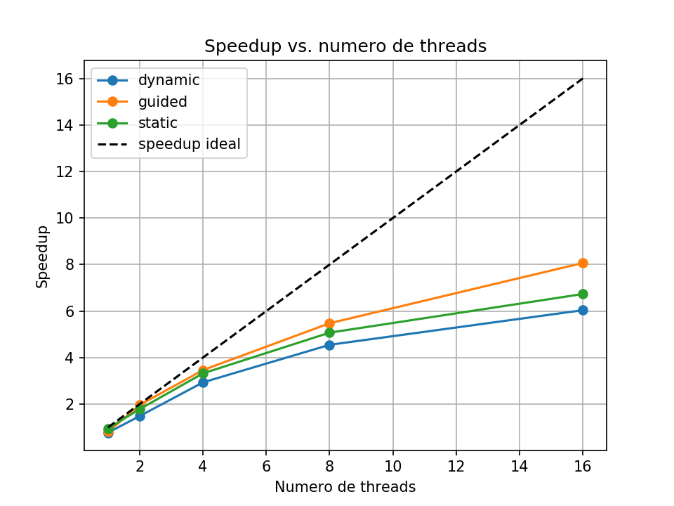
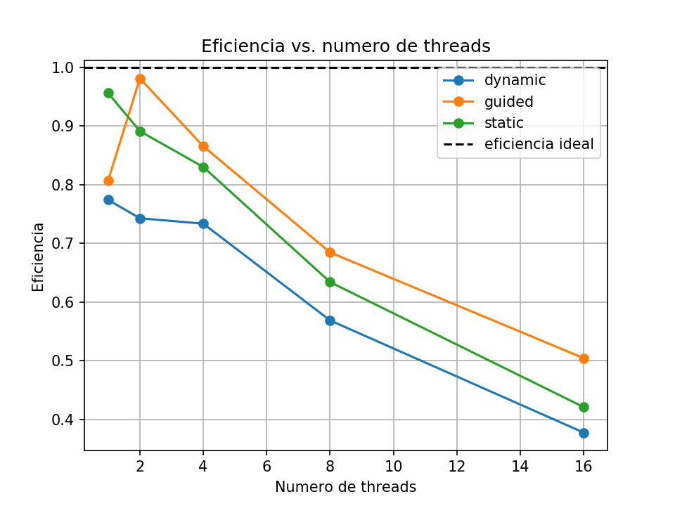
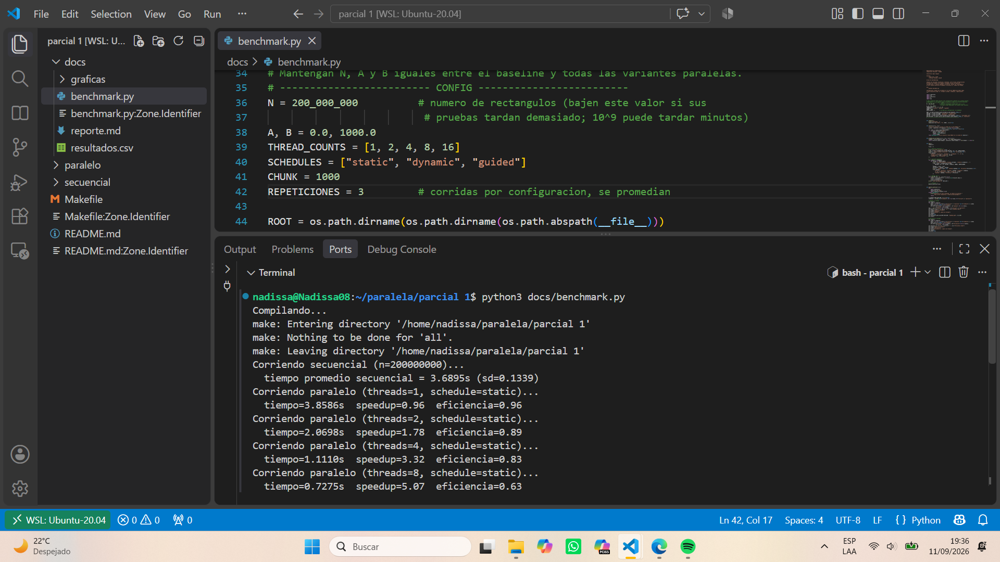
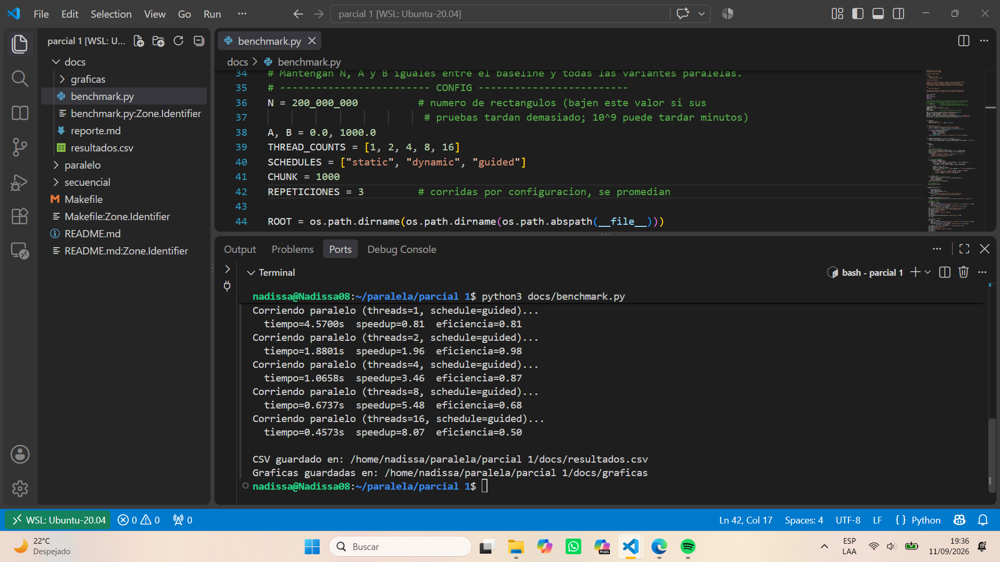
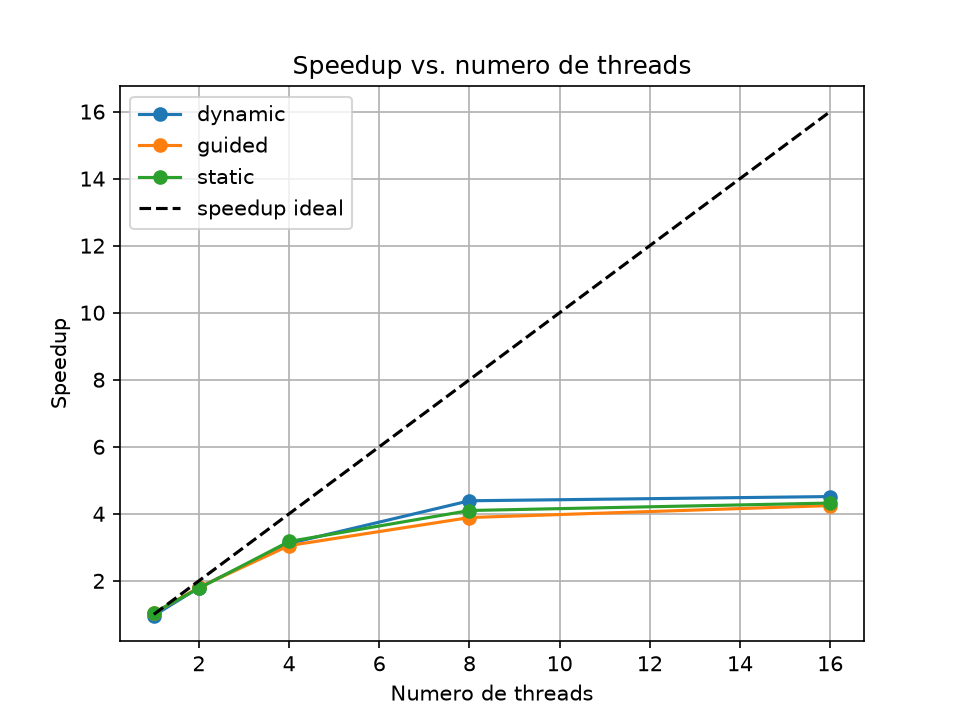
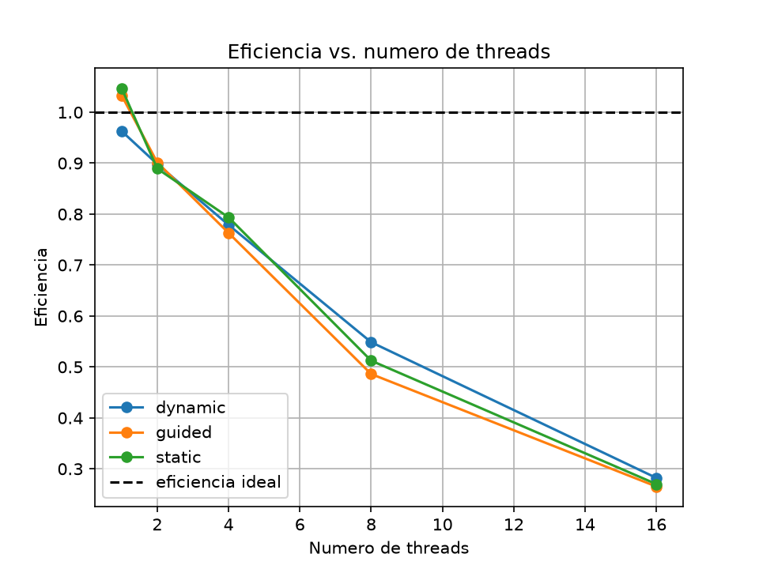
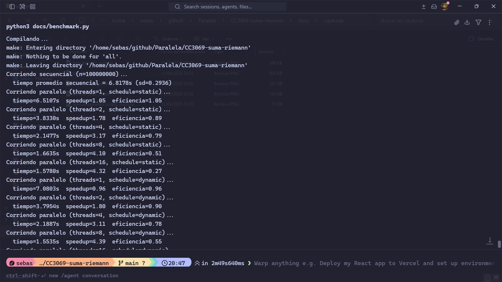
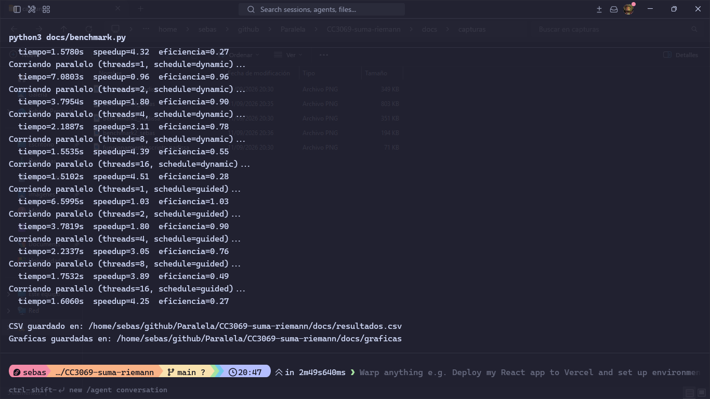

# Reporte — Problema 2: Integración Numérica (Suma de Riemann)

## 1. Contexto y datos

El problema consiste en aproximar la integral definida de una función en el
intervalo `[a,b]`. Se usa la regla compuesta del punto medio: el intervalo se
divide en `n` partes de ancho `h=(b-a)/n` y se suma el área de los rectángulos:

```text
suma = Σ f(a + (i + 0.5)h) h, para i = 0, ..., n-1
```

La implementación evalúa `f(x)=sin(x)cos(x)+x²`. Su integral exacta, útil como
referencia de corrección, es
`(sin²(b)-sin²(a))/2 + (b³-a³)/3`.

- Algoritmo secuencial: un ciclo recorre y acumula las `n` contribuciones.
- Origen de los datos: los valores `n`, `a` y `b` se reciben por línea de
  comandos o usan los valores predeterminados `10^9`, `0` y `1000`.
- Tamaño de muestra elegido: Nadissa Angie utilizó `n=200,000,000` y Cristian
  utilizó `n=100,000,000`. En ambos casos se mantuvieron constantes `n`, `a=0`
  y `b=1000` entre la línea base secuencial y todas las configuraciones paralelas
  del mismo integrante.
- Justificación de la muestra: ambos tamaños producen líneas base de varios
  segundos en sus respectivos equipos, por lo que el trabajo computacional tiene
  suficiente duración para medir el efecto de la paralelización. Los tamaños son
  distintos entre integrantes, así que las comparaciones cuantitativas se realizan
  únicamente contra la línea base obtenida en la misma computadora.
- Memoria: no se almacenan los rectángulos. Se usan variables escalares para
  `h`, `suma`, el índice y el punto medio; la memoria auxiliar es O(1) en la
  versión secuencial y O(P) para las sumas privadas administradas por OpenMP.

## 2. Estrategia de paralelización

La directiva `#pragma omp parallel for reduction(+:suma)` crea un equipo de
threads, reparte las iteraciones independientes y asigna a cada thread un
acumulador privado. Al finalizar el ciclo, OpenMP combina las sumas parciales.
Esto evita la condición de carrera que existiría si todos actualizaran `suma`
directamente, sin el costo de ejecutar `critical` o `atomic` en cada iteración.

El programa desactiva el ajuste dinámico de OpenMP y solicita mediante
`omp_set_num_threads` el número indicado por línea de comandos. Se ofrecen:

- `static`: política predeterminada. Es la candidata principal porque todas las
  iteraciones evalúan la misma expresión y tienen un costo aproximadamente igual.
- `dynamic`: entrega bloques conforme los threads terminan. Puede mejorar cargas
  desbalanceadas, pero aquí normalmente añade overhead.
- `guided`: empieza con bloques grandes y los reduce progresivamente; también se
  incluye para comparación experimental.

El argumento `chunk` solo configura el tamaño mínimo/de bloque en `dynamic` y
`guided`. La rama `static` usa `schedule(static)` sin chunk explícito.

## 3. Metodología de pruebas

Cada integrante debe ejecutar el protocolo completo en su propia computadora:

1. Registrar nombre del integrante, modelo de CPU, núcleos físicos/lógicos,
   sistema operativo y compilador.
2. Cerrar aplicaciones pesadas y mantener condiciones similares entre corridas.
3. Compilar una sola vez con `make`.
4. Hacer una corrida corta de calentamiento que no se registre.
5. Elegir el mismo `n`, `a` y `b` para la versión secuencial y todas las paralelas.
6. Ejecutar al menos cinco repeticiones por configuración y reportar promedio y
   desviación estándar (o mediana, si se justifica y se usa consistentemente).
7. Probar `P=1,2,4,...` hasta el número de threads lógicos del equipo. No es
   necesario probar 16 si el equipo no dispone de 16 threads lógicos.
8. Usar `static` como comparación principal. Comparar además `dynamic` y `guided`
   con el mismo chunk; si se estudian varios chunks, cambiar solo ese parámetro.
9. Confirmar que las áreas secuencial y paralela coincidan dentro de una
   tolerancia razonable; pequeñas diferencias finales son normales por el orden
   de las operaciones de punto flotante.
10. Capturar terminal, parámetros y salidas como evidencia. No medir el tiempo de
    compilación ni combinar resultados de máquinas distintas.

Valores sugeridos para explorar antes de elegir la muestra final: `n=10^6`,
`10^7`, `10^8` y, si el tiempo es razonable, `10^9`. Para la tabla definitiva se
debe escoger un `n` suficientemente grande para que el trabajo domine el overhead
de OpenMP y mantenerlo fijo en la comparación de threads/schedules.

Comandos de ejemplo desde la raíz:

```bash
make
./secuencial/riemann_seq 100000000 0 1000
./paralelo/riemann_par 100000000 0 1000 4 static
./paralelo/riemann_par 100000000 0 1000 4 dynamic 1000
./paralelo/riemann_par 100000000 0 1000 4 guided 1000
python3 docs/benchmark.py
```

## 4. Resultados y métricas individuales

Para cada integrante y cada configuración:

```text
Speedup S = T_secuencial / T_paralelo
Eficiencia E = S / P
```

`T_secuencial` es el tiempo promedio de la versión secuencial;
`T_paralelo`, el promedio de la versión paralela; y `P`, el número de threads de
esa corrida. La eficiencia puede expresarse como fracción o como porcentaje
`100E%`, indicando cuál formato se usa.

### Integrante: Nadissa Angie Vela

Equipo/CPU: 
  - Procesador 11th Gen Intel(R) Core(TM) i7-11800H @ 2.30GHz (2.30 GHz) 
  - 8 nucleos, 16 hilos
  - RAM 16.0 GB
Sistema/compilador:
  - Windows 11 Home Single Language

#### Configuración experimental

Las mediciones de Nadissa Angie se realizaron con `n=200,000,000` rectángulos en el
intervalo `[0,1000]`. Se probaron `1`, `2`, `4`, `8` y `16` threads con los
schedules `static`, `dynamic` y `guided`. Para `dynamic` y `guided` se utilizó un
chunk de `1000`; en `static` este parámetro no se usa. Cada valor de la tabla es
el promedio de tres repeticiones y se acompaña con su desviación estándar. Las
capturas documentan la ejecución en WSL Ubuntu 20.04 sobre un equipo con Intel
Core i7-11800H, 8 núcleos, 16 hilos y 16 GB de RAM.
Los valores originales, sin redondear, se conservan en
[`resultados_nadissa.csv`](resultados_nadissa.csv).

#### Resultados

| Versión | Threads | Schedule | Chunk | Tiempo promedio (s) | SD (s) | Speedup | Eficiencia |
|---|---:|---|---:|---:|---:|---:|---:|
| Secuencial | 1 | — | — | 3.6895 | 0.1339 | 1.0000x | 100.00% |
| Paralela | 1 | static | N/A | 3.8586 | 0.5101 | 0.9562x | 95.62% |
| Paralela | 2 | static | N/A | 2.0698 | 0.0585 | 1.7826x | 89.13% |
| Paralela | 4 | static | N/A | 1.1110 | 0.1229 | 3.3209x | 83.02% |
| Paralela | 8 | static | N/A | 0.7275 | 0.0287 | 5.0716x | 63.40% |
| Paralela | 16 | static | N/A | 0.5480 | 0.0427 | 6.7327x | 42.08% |
| Paralela | 1 | dynamic | 1000 | 4.7665 | 0.6043 | 0.7740x | 77.40% |
| Paralela | 2 | dynamic | 1000 | 2.4835 | 0.2138 | 1.4856x | 74.28% |
| Paralela | 4 | dynamic | 1000 | 1.2573 | 0.0982 | 2.9344x | 73.36% |
| Paralela | 8 | dynamic | 1000 | 0.8110 | 0.0584 | 4.5491x | 56.86% |
| Paralela | 16 | dynamic | 1000 | 0.6112 | 0.0198 | 6.0370x | 37.73% |
| Paralela | 1 | guided | 1000 | 4.5700 | 0.5612 | 0.8073x | 80.73% |
| Paralela | 2 | guided | 1000 | 1.8801 | 0.2159 | 1.9624x | 98.12% |
| Paralela | 4 | guided | 1000 | 1.0658 | 0.0565 | 3.4619x | 86.55% |
| Paralela | 8 | guided | 1000 | 0.6737 | 0.0274 | 5.4763x | 68.45% |
| Paralela | 16 | guided | 1000 | 0.4573 | 0.0180 | 8.0677x | 50.42% |

El tiempo secuencial promedio de `3.6895 s` funciona como línea base para
calcular el speedup y la eficiencia de todas las configuraciones paralelas de
Nadissa. Esto mantiene la comparación en el mismo entorno y con el mismo tamaño
del problema.

#### Escalabilidad y comparación de schedules

Con `schedule(static)`, un thread obtuvo un speedup de `0.9562x`, por lo que no
superó la línea base secuencial. La diferencia es coherente con el overhead de
crear y administrar la región paralela y efectuar la reducción cuando no existe
paralelismo efectivo. A partir de dos threads aparece una mejora clara: el
speedup aumenta a `1.7826x`, `3.3209x`, `5.0716x` y `6.7327x` al utilizar 2, 4,
8 y 16 threads, respectivamente.

El crecimiento no es lineal. Aunque el tiempo continúa disminuyendo, la
eficiencia de `static` baja de `89.13%` con dos threads a `42.08%` con 16. Esto
no representa un error: al aumentar `P`, el overhead de OpenMP, la reducción y
los límites de los recursos compartidos adquieren mayor peso respecto del
trabajo útil. La Figura 1 muestra esta separación progresiva respecto del
speedup ideal, mientras que la Figura 2 presenta la disminución de eficiencia.



*Figura 1. Speedup medido para los schedules static, dynamic y guided.*



*Figura 2. Eficiencia medida en función del número de threads.*

La planificación influyó en el rendimiento observado. Con ocho threads,
`guided` alcanzó `5.4763x`, frente a `5.0716x` de `static` y `4.5491x` de
`dynamic`. Con 16 threads, los resultados fueron `8.0677x` y `50.42%` para
`guided`, `6.7327x` y `42.08%` para `static`, y `6.0370x` y `37.73%` para
`dynamic`. Por tanto, `guided` produjo el mejor resultado global de estas
corridas, especialmente con 16 threads. Este resultado es experimental y no
implica que `guided` sea siempre superior en otros equipos o problemas.

En esta integración, todas las iteraciones tienen un costo computacional muy
similar. La asignación frecuente de bloques de `dynamic` introduce overhead y
no necesariamente aporta una ventaja de balance de carga; en estas mediciones
fue el schedule con menor speedup para cada cantidad de threads. Las decisiones
que hicieron efectiva la mejora sobre el algoritmo secuencial fueron repartir
las iteraciones independientes, combinar las sumas parciales mediante
`reduction` y evaluar empíricamente la política de planificación, sin cambiar la
aproximación matemática.

#### Mejor configuración y variabilidad

La mejor configuración observada fue `guided` con 16 threads: redujo el tiempo
promedio de `3.6895 s` a `0.4573 s`, obtuvo un speedup de `8.0677x` y una
eficiencia de `50.42%`. Esto equivale a una reducción aproximada del `87.60%`
del tiempo frente a la línea base y constituye la mayor aceleración medida en
los experimentos de Nadissa.

Las desviaciones estándar muestran que hubo variación entre repeticiones, razón
por la cual se reporta el promedio. Entre las configuraciones de mayor número de
threads, `guided` con 16 obtuvo una SD de `0.0180 s`, `dynamic` con 16 una de
`0.0198 s`, `static` con 8 una de `0.0287 s` y `static` con 16 una de `0.0427 s`.
Estos valores describen la dispersión observada, sin asumir que el mismo nivel de
variabilidad se repetirá en otros entornos.

#### Evidencia de ejecución y validación funcional

Las Figuras 3 y 4 muestran la ejecución real del benchmark, incluyendo la línea
base, configuraciones de los tres schedules y la generación del CSV y las
gráficas. La Figura 5 corresponde a una comprobación directa con `n=1,000,000`:
las áreas secuencial (`333333333.6751188040`) y paralela
(`333333333.6751126647`) son prácticamente iguales. La pequeña diferencia en
las últimas cifras es esperable por el orden distinto de acumulación en punto
flotante de la reducción paralela y no indica un error de implementación.



*Figura 3. Línea base y primeras configuraciones registradas por el benchmark.*



*Figura 4. Resultados de guided y generación de los artefactos del benchmark.*


*Figura 5. Comparación funcional de las áreas producidas por ambas versiones.*

#### Respuesta resumida

- **¿La paralelización mejoró el algoritmo?** Sí. Para dos o más threads redujo
  claramente el tiempo, y la mejor corrida pasó de `3.6895 s` a `0.4573 s`.
- **¿Cuál fue el mejor speedup?** `8.0677x`.
- **¿Cuál fue la mejor configuración?** 16 threads, `schedule(guided)` y chunk
  `1000`, con eficiencia de `50.42%`.
- **¿Qué pasó con la eficiencia al aumentar threads?** En general disminuyó al
  crecer `P`, aunque el speedup siguió aumentando; es un efecto esperado del
  overhead y del escalamiento no lineal.
- **¿Qué schedule tuvo mejor desempeño?** `guided` obtuvo el mejor desempeño en
  estas pruebas, sin que ello implique superioridad universal.


### Integrante: Cristian Tunchez

Equipo/CPU:
- AMD Ryzen 5 3500U with Radeon Vega Mobile Gfx (2.10 GHz)
- 4 núcleos, 8 hilos
- RAM 8.0 GB
Sistema/compilador:
- Windows 11 Home Single Language

#### Configuración experimental

Cristian realizó sus mediciones con `n=100,000,000` rectángulos en el intervalo
`[0,1000]`. Probó `1`, `2`, `4`, `8` y `16` threads con los schedules `static`,
`dynamic` y `guided`. El chunk fue `1000` para `dynamic` y `guided`; no se usa en
la variante `static`. Cada tiempo corresponde al promedio de tres repeticiones y
se presenta junto con su desviación estándar. Los valores originales se conservan
en [`resultados_sebas.csv`](resultados_sebas.csv).

#### Resultados

| Versión | Threads | Schedule | Chunk | Tiempo promedio (s) | SD (s) | Speedup | Eficiencia |
|---|---:|---|---:|---:|---:|---:|---:|
| Secuencial | 1 | — | — | 6.8178 | 0.2936 | 1.0000x | 100.00% |
| Paralela | 1 | static | N/A | 6.5107 | 0.0703 | 1.0472x | 104.72% |
| Paralela | 2 | static | N/A | 3.8330 | 0.1031 | 1.7787x | 88.93% |
| Paralela | 4 | static | N/A | 2.1477 | 0.0532 | 3.1745x | 79.36% |
| Paralela | 8 | static | N/A | 1.6635 | 0.0598 | 4.0985x | 51.23% |
| Paralela | 16 | static | N/A | 1.5780 | 0.0529 | 4.3206x | 27.00% |
| Paralela | 1 | dynamic | 1000 | 7.0803 | 0.3415 | 0.9629x | 96.29% |
| Paralela | 2 | dynamic | 1000 | 3.7954 | 0.0540 | 1.7963x | 89.82% |
| Paralela | 4 | dynamic | 1000 | 2.1887 | 0.0522 | 3.1150x | 77.87% |
| Paralela | 8 | dynamic | 1000 | 1.5535 | 0.0552 | 4.3887x | 54.86% |
| Paralela | 16 | dynamic | 1000 | 1.5102 | 0.0328 | 4.5146x | 28.22% |
| Paralela | 1 | guided | 1000 | 6.5995 | 0.2439 | 1.0331x | 103.31% |
| Paralela | 2 | guided | 1000 | 3.7819 | 0.0176 | 1.8028x | 90.14% |
| Paralela | 4 | guided | 1000 | 2.2337 | 0.0383 | 3.0522x | 76.30% |
| Paralela | 8 | guided | 1000 | 1.7532 | 0.0188 | 3.8888x | 48.61% |
| Paralela | 16 | guided | 1000 | 1.6060 | 0.1156 | 4.2453x | 26.53% |

La línea base de Cristian fue `6.8178 s`. Los speedups y eficiencias de esta
subsección se calculan exclusivamente con ese tiempo, porque sus pruebas se
realizaron en un equipo y con un valor de `n` diferentes a los de Nadissa Angie.

#### Escalabilidad y comparación de schedules

Los tres schedules muestran una reducción clara del tiempo al pasar de uno a
varios threads. Con `static`, el speedup evoluciona de `1.7787x` con 2 threads a
`3.1745x` con 4, `4.0985x` con 8 y `4.3206x` con 16. La mejora adicional entre 8
y 16 threads es pequeña: el tiempo solo baja de `1.6635 s` a `1.5780 s`, mientras
la eficiencia cae de `51.23%` a `27.00%`. La Figura 6 muestra que las curvas se
alejan del speedup ideal conforme aumenta `P`, y la Figura 7 evidencia la pérdida
de eficiencia.



*Figura 6. Speedup medido por Cristian para los tres schedules.*



*Figura 7. Eficiencia de las configuraciones evaluadas por Cristian.*

La reducción de eficiencia no constituye un fallo del programa. Cristian dispone
de 4 núcleos y 8 hilos de hardware; ejecutar 16 threads de OpenMP supera esa
capacidad lógica y es consistente con las ganancias decrecientes observadas, ya
que aumenta la competencia por recursos sin duplicar la capacidad física. También
intervienen el costo de crear y coordinar threads y la combinación final de la
reducción.

El schedule con mejor desempeño no fue el mismo para todas las cantidades de
threads: `guided` obtuvo el mayor speedup con 2 (`1.8028x`), `static` con 4
(`3.1745x`) y `dynamic` con 8 (`4.3887x`) y 16 (`4.5146x`). Las diferencias entre
schedules son relativamente pequeñas frente al efecto de aumentar threads hasta
8. Aunque las iteraciones tienen costos similares y `dynamic` puede introducir
overhead de asignación, en este equipo produjo el mejor resultado global. Esta es
una observación limitada a las corridas de Cristian, no una propiedad universal
de `dynamic`.

Los valores de un thread para `static` (`1.0472x`) y `guided` (`1.0331x`) quedan
ligeramente por encima de la línea base, mientras `dynamic` obtuvo `0.9629x`.
Estas diferencias pequeñas no representan aceleración por paralelismo con un solo
thread; deben interpretarse junto con la variabilidad entre corridas y los costos
distintos del runtime. De igual manera, una eficiencia mayor a 100% con `P=1`
solo refleja que esa media fue algo menor que la media secuencial de referencia.

#### Mejor configuración y variabilidad

La mejor configuración de Cristian fue `dynamic` con 16 threads y chunk `1000`:
alcanzó `1.5102 s`, speedup de `4.5146x` y eficiencia de `28.22%`. Frente a la
línea base de `6.8178 s`, representa una reducción aproximada del `77.85%` del
tiempo. Sin embargo, el salto de 8 a 16 threads fue reducido (`4.3887x` a
`4.5146x`), por lo que 8 threads ofrecieron una relación más favorable entre
aceleración y eficiencia (`54.86%`).

La desviación estándar de la mejor configuración fue `0.0328 s`. Para 16 threads,
`static` presentó `0.0529 s` y `guided`, `0.1156 s`; la línea base tuvo
`0.2936 s`. Las repeticiones y el uso del promedio permiten representar esta
variabilidad sin depender de una sola corrida.

#### Evidencia de ejecución

Las Figuras 8 y 9 documentan la ejecución del benchmark de Cristian. En ellas se
observan la línea base, las configuraciones de threads y schedules, y la creación
del CSV y las gráficas utilizadas en el análisis.



*Figura 8. Línea base y primeras configuraciones del benchmark de Cristian.*



*Figura 9. Configuraciones restantes y generación de resultados de Cristian.*

#### Respuesta resumida

- **¿La paralelización mejoró el algoritmo?** Sí. La mejor configuración redujo
  el tiempo de `6.8178 s` a `1.5102 s`.
- **¿Cuál fue el mejor speedup?** `4.5146x`.
- **¿Cuál fue la mejor configuración?** 16 threads, `schedule(dynamic)` y chunk
  `1000`, con eficiencia de `28.22%`.
- **¿Qué pasó con la eficiencia?** Disminuyó al crecer el número de threads y la
  ganancia fue especialmente limitada al superar los 8 hilos lógicos del equipo.
- **¿Qué schedule tuvo mejor desempeño?** `dynamic` obtuvo el mejor resultado
  global de las pruebas de Cristian, aunque el ganador varió según `P`.

## 5. Conclusiones

La paralelización de la suma de Riemann con OpenMP redujo de forma importante el
tiempo de ejecución en las dos computadoras. La independencia de las iteraciones
permitió distribuir el ciclo con `parallel for`, mientras `reduction(+:suma)`
evitó condiciones de carrera y mantuvo resultados numéricamente consistentes con
la versión secuencial. Esta estrategia mejoró el rendimiento sin modificar el
método del punto medio ni la función integrada.

En las pruebas de Nadissa Angie, el mejor resultado fue `guided` con 16 threads:
`0.4573 s`, speedup de `8.0677x` y eficiencia de `50.42%`, frente a una línea base
de `3.6895 s`. En las de Cristian, el mejor resultado fue `dynamic` con 16
threads: `1.5102 s`, speedup de `4.5146x` y eficiencia de `28.22%`, frente a su
línea base de `6.8178 s`. Estos valores no deben compararse como una competencia
directa entre equipos, pues se usaron procesadores y tamaños de `n` diferentes;
cada speedup es válido respecto de la línea base local del mismo integrante.

En ambos casos el speedup aumentó con el número de threads, pero no de forma
lineal, y la eficiencia disminuyó conforme creció `P`. El comportamiento refleja
que el overhead de OpenMP y los recursos limitados del procesador adquieren mayor
peso al añadir threads. La saturación es más visible en el equipo de Cristian al
pasar de 8 a 16 threads, cantidad que excede sus 8 hilos de hardware. Por ello,
la configuración con menor tiempo no necesariamente es la de mejor eficiencia.

Los resultados también demuestran que el schedule óptimo depende del entorno:
`guided` fue superior en las corridas de Nadissa Angie, mientras `dynamic` obtuvo
el mejor tiempo global en las de Cristian. Aunque `static` era una elección
teórica razonable por el costo uniforme de las iteraciones, las mediciones reales
justifican evaluar varias políticas en cada máquina. En consecuencia, la
paralelización fue efectiva para esta carga grande, pero su beneficio práctico
depende del número de threads, del runtime de OpenMP y del hardware disponible.
